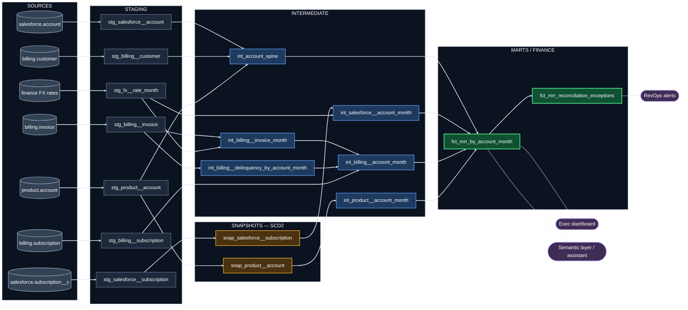

# Pipeline design

Snapshots are proposed, not built. The project reads staging directly and flags the affected columns `status_is_inferred`, because a snapshot has no history until it has been running a while and there was none to seed.

## The decisions

**Reconciliation sits at account-month.** Salesforce `subscription__c.id` and `billing.subscription.id` share no key, and one account can carry several rows on either side. The account is the finest level at which all three systems agree on identity, so it is the only level where they can be compared.

Open check: count product accounts per billing customer. If product accounts fan out under one billing customer, "account" has to mean the Salesforce account and per-account MRR needs an allocation rule.

**The spine feeds the intermediates, not just the fact.** Each per-system model translates its native key to a resolved `account_id` before anything is unioned, because a union is only meaningful over one key space. The alternative is to leave the intermediates in native keys and join through the spine's per-system columns in the fact; I chose upstream so anything else reading those models inherits the resolved key.

**Billing splits into three models.** `int_billing__invoice_month` spreads each invoice across the months its period covers, which is what turns annual prepay into a monthly amount instead of a 12x spike. It's separate because the spread is the billing logic most likely to be wrong, and because a spread-by-service-month table is the shape anything doing revenue-over-time would want. `int_billing__delinquency_by_account_month` derives days past due, and is separate because collections consumes it with no interest in MRR.

**Currency converts at the same rate on both sides.** That's the part that matters for reconciliation: if the two sides use different rates, every non-USD account shows a gap the pipeline invented. I've used the reporting month's rate because it's the one rule both sides can apply, but which rate Finance actually wants is their call, and the swap is a one-join change.

## The fact table

| | |
|---|---|
| `account_id`, `month_start_date` | grain |
| `salesforce_mrr_usd`, `salesforce_status`, `billing_mrr_usd`, `billing_status`, `product_status`, `product_plan_tier` | each system's belief, side by side |
| `mrr_usd` | the reconciled number, by a precedence rule keyed to the case |
| `reconciliation_case` | `matches`, `amount_mismatch`, `billing_only`, `salesforce_only`, `product_only`, `status_conflict`, `policy_undecided` |
| `disputed_mrr_usd` | dollars the systems don't agree on |
| `is_in_scope` | internal, test, and soft-deleted accounts stay as rows and are excluded by the metric, not by an upstream `WHERE` |

`is_in_scope` and `reconciliation_case` are separate on purpose. Scope is whether an account counts at all; the case is how the systems disagree. LP QA Account 4 is both, and one column would hide one of them.

## History, and what limits reconciling past months

Account-month grain assumes each system's belief can be stated for any month. The three sources differ in whether that's possible today.

**Billing** is derivable. Invoices accumulate and carry `period_start`, `period_end`, and `issued_at`.

**Salesforce** is partially derivable. Contract terms give a timeline; field history is what shows when `mrr__c` and `status__c` actually changed. The project reads terms, not field history.

**Product** is not derivable. A nightly snapshot that overwrites leaves current state only. Northshore reads `suspended` today, and nothing says when that started.

So reconciliation for closed months is limited by product history, and any backfill has to say so rather than imply equal confidence across all three. Forward fix: `dbt snapshot` with the `check` strategy on product `status` and `plan_tier`. A nightly full-overwrite source with no reliable updated-at is exactly what that strategy exists for.

## Deliberately excluded

**`billing.credit_note`**, because a credit adjusts what's owed on an invoice rather than the contracted amount. That's the simple reading and it may not survive contact with the real data — credits are also how some shops express a mid-term downgrade, which would change the run rate. Worth confirming before it stays excluded.

**`salesforce.opportunity`**, because bookings aren't recurring revenue. Whether Finance counts signed-but-unprovisioned contracts is a definitional question rather than a modelling one.
